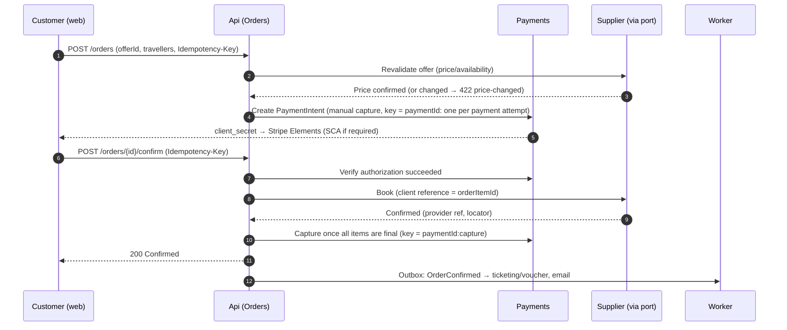
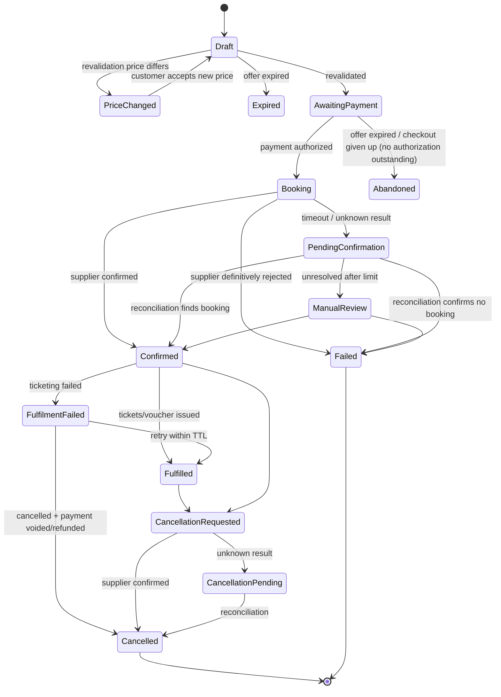

# Booking lifecycle

**Status:** ADR 0005 is accepted for flights. States are refined during Phase 3 and must stay in sync with code and tests (`Modules.Orders`, from Phase 3 chunk 1).

## Checkout orchestration (happy path)

When the supplier write outcome is unknown (timeout or ambiguous 5xx), the API responds `202 Accepted` with the order in `PendingConfirmation`. The Worker reconciles.

**As built (Phase 3 chunk 3), up to `Booking`, with no endpoint:** `AuthorizeCheckoutHandler` (Orders) takes the signed-in customer's own order (Q8), and only while it awaits payment.
0. If an attempt was already made with this payment key, it is finished first (`IOrderPayments.ResumeAsync`: a lookup, never a second authorization), whatever the supplier says now. After a timeout the funds may be held, and only this lookup finds them.
1. Otherwise it revalidates every item with the supplier through `IFlightSelections.RevalidateAsync`. A changed price, an expired or sold-out offer, or an offer with under two minutes left stops the checkout with nothing authorized.
2. `Order.RefreshOffer` adopts the fresh expiry. It adopts a new price only with a newly accepted quote (F-01), and records that on the timeline.
3. It authorizes the server-side order total through `IOrderPayments`.
4. Only an authorized payment of exactly the order's total moves the order to `Booking` (`StartBooking` with the payment attempt id). A decline, a challenge, an unknown outcome or a manual review leaves the order `AwaitingPayment`. An authorization the order will not book on (a different amount, or the offer expired meanwhile) is noted once on the timeline, with its reference, as a hold to release (`AuthorizedButNotBookable`); the release itself comes with the void step.

The supplier booking itself needs the travellers (Q9) and comes next.

## Order item (booking) state machine

Notes:
- **As built (Phase 3 chunk 1):** an order item is created only from a Flights selection that is already revalidated and `Confirmed` (chunk 5), so `Draft` is transient (`Draft → AwaitingPayment` at creation). `Draft → PriceChanged` and `Draft → Expired` are handled before ordering by the selection's own state machine. An offer expiring while awaiting payment is `AwaitingPayment → Abandoned` (and booking is refused once it has expired). A card decline leaves the item `AwaitingPayment` for another attempt (F-20). An authorization with an unknown outcome is resolved on the payment side and never becomes `Abandoned` while a hold may exist. The payment authorization belongs to the order: `StartBooking` moves all items to `Booking` together, and every timeline entry carries its provider reference. A booking that exists but not as agreed (a supplier `Mismatch`, chunk 6) is `Booking → ManualReview`.
- `SupplierChanged` (schedule change or hotel walk) will be added as a flag/sub-state on `Confirmed`/`Fulfilled` when involuntary changes are implemented.
- The **Order status is derived** from its items: all confirmed → `Confirmed`; mixed → `PartiallyConfirmed`; any pending → `Pending`; all failed → `Failed`.

## Invariants
1. Only aggregate methods change state. Every change appends to the **timeline** (actor, timestamp, from→to, reason, correlation ID, provider reference).
2. `Booking → Failed` only on a **definitive** supplier rejection. Timeouts and ambiguous errors go to `PendingConfirmation`.
3. Reconciliation queries the supplier by our client reference. **The book call is never resubmitted.**
4. Payment is voided only once the booking is known not to exist (`Failed`), never from `PendingConfirmation`.
5. Capture happens only for `Confirmed` items. Capture amount = sum of confirmed item prices (partial capture for partially confirmed orders).
6. All transitions are idempotent. Re-applying the same event (e.g. a duplicate webhook or reconciliation result) is a no-op.

## Background jobs (Worker)
| Job | Trigger | Action |
|---|---|---|
| Reconcile pending bookings | Items in `PendingConfirmation` / `CancellationPending` | Query the supplier with backoff; transition; escalate to `ManualReview` after a limit (TBD) |
| Expire unpaid orders (`orders.expire-unpaid`, built) | An item `AwaitingPayment` whose offer expired | With no live payment attempt: `AwaitingPayment → Abandoned`. With an authorized hold or an unfinished challenge: a timeline note plus `OrderPaymentReleaseRequested` (once), and the order waits. With an unknown outcome, a void in progress or a manual review: it waits |
| Reconcile payment attempts (`payments.reconcile-attempts`, built) | Open attempts; holds Orders will not use | Look up by our reference; void the hold once (see payment lifecycle) |
| Orders outbox (`orders.outbox`, built) | Pending Orders integration events | Deliver to in-process handlers at least once, oldest first, with back-off; given up after 10 attempts (`FailedAt`, error log) |
| Authorization expiry guard | Authorized payments approaching expiry | Alert/escalate (should not occur for instant flows) |
| Fulfilment | `OrderConfirmed` outbox event | Ticketing/voucher retrieval, then email |

**Before the order exists (Phase 2).** The customer's selected offer (`SelectedOffer`) is revalidated with its own small state machine: `Selected` → `Confirmed` / `PriceChanged` → `Confirmed`, or `Expired` / `SoldOut`. A changed price becomes a quote the customer accepts by id. The selection also keeps the supplier's fare facts as last seen (price breakdown, baggage, conditions, validating carrier, ticketing deadline) for booking and receipts. This pre-order artefact has no booking timeline. When the Order is created (Phase 3), it must snapshot the agreed price, the accepted quote id and the acceptance instant onto the order and its timeline, as consent evidence. Only a `Confirmed` selection from a fresh revalidation may be booked.

Related: [payment lifecycle](payment-lifecycle.md), [failure scenarios](../quality/failure-scenarios.md).
