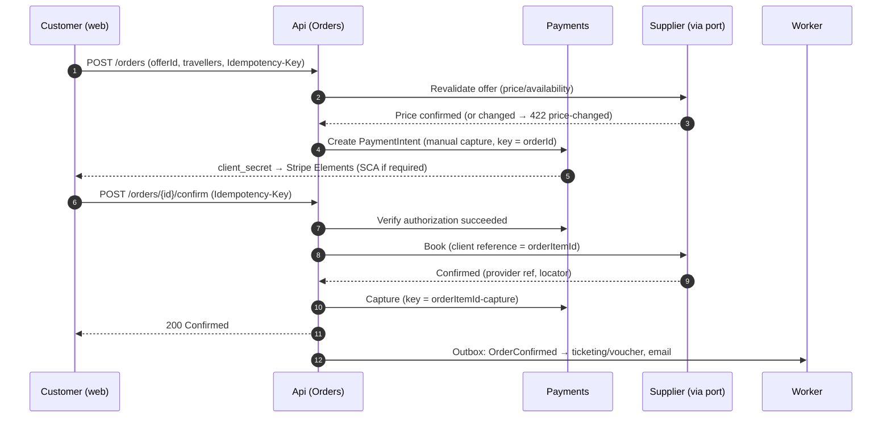
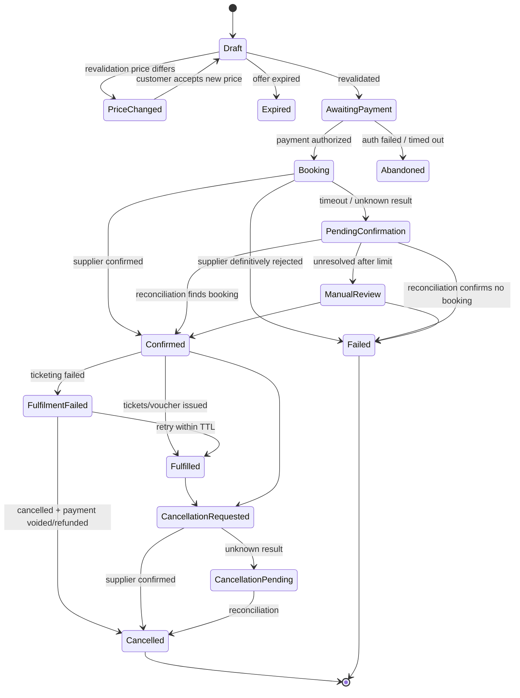

# Booking lifecycle

**Status: Draft.** Proposed in ADR 0005. States will be refined during Phase 3 and must stay in sync with code and tests.

## Checkout orchestration (happy path)

When the supplier write outcome is unknown (timeout or ambiguous 5xx), the API responds `202 Accepted` with the order in `PendingConfirmation`. The Worker reconciles.

## Order item (booking) state machine

Notes:
- `SupplierChanged` (schedule change or hotel walk) will be added as a flag/sub-state on `Confirmed`/`Fulfilled` when involuntary changes are implemented.
- The **Order status is derived** from its items: all confirmed → `Confirmed`; mixed → `PartiallyConfirmed`; any pending → `Pending`; all failed → `Failed`.

## Invariants
1. Only aggregate methods change state. Every change appends to the **timeline** (actor, timestamp, from→to, reason, correlation ID, provider reference).
2. `Booking → Failed` only on a **definitive** supplier rejection. Timeouts and ambiguous errors go to `PendingConfirmation`.
3. Reconciliation queries the supplier by our client reference. **The book call is never resubmitted.**
4. Payment is voided only once the booking is known not to exist (`Failed`), never from `PendingConfirmation`.
5. Capture happens only for `Confirmed` items. Capture amount = sum of confirmed item prices (partial capture for partially confirmed orders).
6. All transitions are idempotent. Re-applying the same event (e.g. a duplicate webhook or reconciliation result) is a no-op.

## Background jobs (Worker)
| Job | Trigger | Action |
|---|---|---|
| Reconcile pending bookings | Items in `PendingConfirmation` / `CancellationPending` | Query the supplier with backoff; transition; escalate to `ManualReview` after a limit (TBD) |
| Expire offers/drafts | Offer expiry passed | `Draft → Expired` |
| Authorization expiry guard | Authorized payments approaching expiry | Alert/escalate (should not occur for instant flows) |
| Fulfilment | `OrderConfirmed` outbox event | Ticketing/voucher retrieval, then email |

Related: [payment lifecycle](payment-lifecycle.md), [failure scenarios](../quality/failure-scenarios.md).
