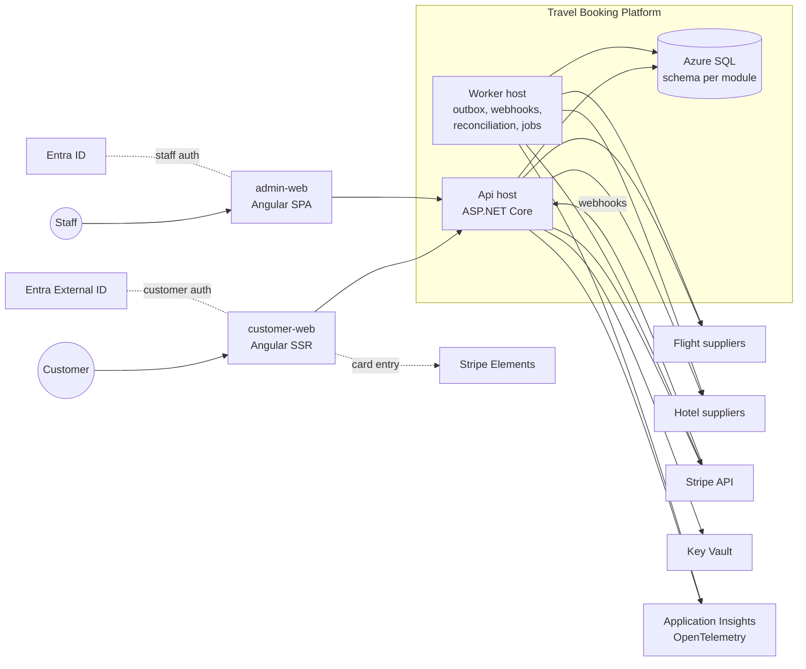

# Architecture overview

**Status: Proposed.** See ADRs 0002–0011.

## System context

## Deployables
| Deployable | Responsibility |
|---|---|
| `customer-web` | Public site (SSR for landing/content, client-rendered booking flow) |
| `admin-web` | Staff portal (SPA, strict CSP, staff SSO) |
| `Api` | HTTP API for both frontends (`/api/v1`, `/api/admin/v1`) and webhook receivers (verify + persist only) |
| `Worker` | Outbox dispatch, webhook processing, reconciliation of unknown states, offer/authorization expiry, notifications, scheduled reports |

`Api` and `Worker` are built from the same modules. Each module registers its endpoints (Api) and background handlers (Worker).

## Modules (initial map, created when needed)
| Module | Owns |
|---|---|
| **Orders** | Order aggregate, order items, checkout orchestration, booking timeline |
| **Flights** | Flight search, offers, flight booking lifecycle, `IFlightProvider` port |
| **Hotels** | Hotel search, rates, hotel booking lifecycle, `IHotelProvider` port |
| **Payments** | Payment intents, authorizations, captures, voids, refunds, disputes, webhooks inbox, `IPaymentProvider` port |
| **Pricing** | Markups, promotions, fees, price breakdown calculation |
| **Customers** | Customer profiles, saved travellers (PII), consents |
| **Access** | Staff users, roles, permissions (identity lives in the IdP) |
| **Notifications** | Emails and templates, document delivery (tickets/vouchers) |
| **Audit** | Append-only audit log, security events |
| **Providers** | Supplier configuration, enablement, health |
| **Reporting** | Read models and exports for ops and finance |

Supplier adapters live in `Integrations.*` projects (e.g. `Integrations.Flights.Mock`, `Integrations.Payments.Stripe`) and implement the module ports.

## Key cross-cutting mechanisms (BuildingBlocks)
- `Money`, `Currency`, `Result<T>`, typed IDs
- Idempotency store (unique `(Scope, Key)`, stored response)
- Transactional outbox + inbox, dispatched by the Worker, and DB job leases (built: `BuildingBlocks/Background`). Each module maps these tables in its own schema. For this, BuildingBlocks references EF Core (SQL Server) and the ASP.NET Core shared framework, which an architecture test keeps out of adapters and Contracts
- Audit and timeline writers
- `TimeProvider` everywhere; correlation ID propagation; PII redaction for logs and supplier payload capture

## Detailed designs
- [Booking lifecycle](booking-lifecycle.md)
- [Payment lifecycle](payment-lifecycle.md)
- [Provider integration](provider-integration.md)
- [Security](security.md)
- [Observability](observability.md)
