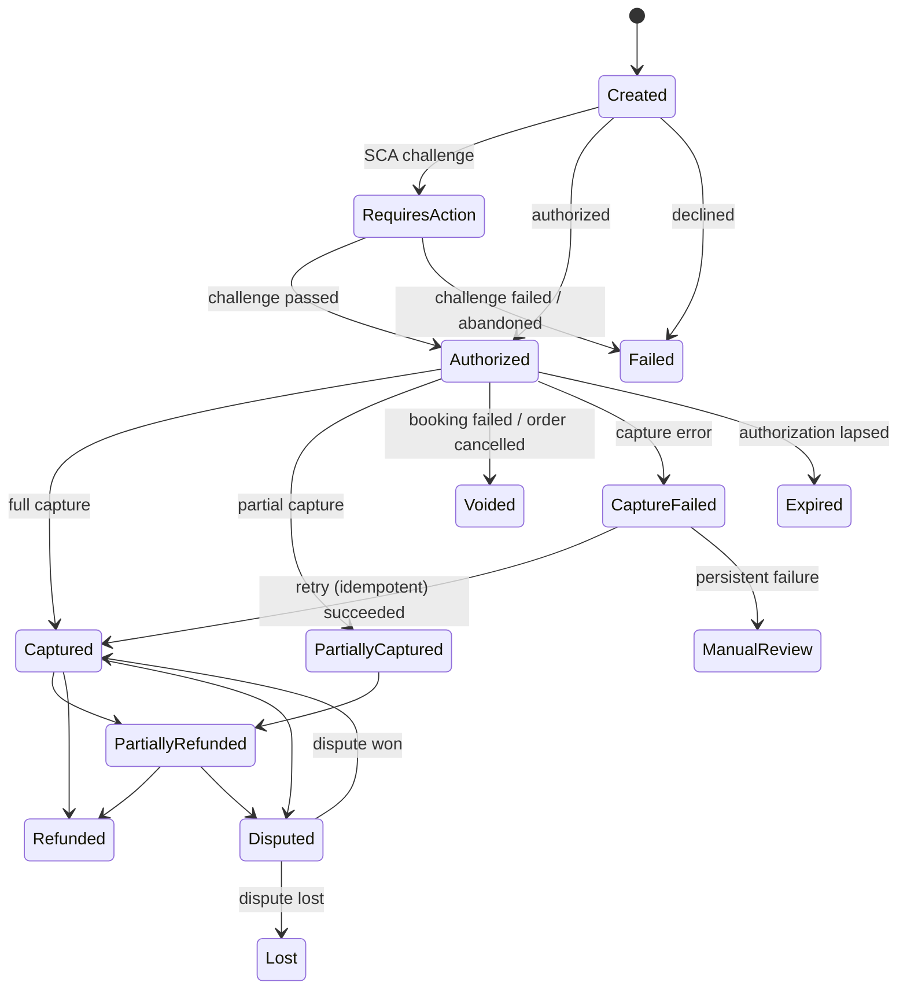
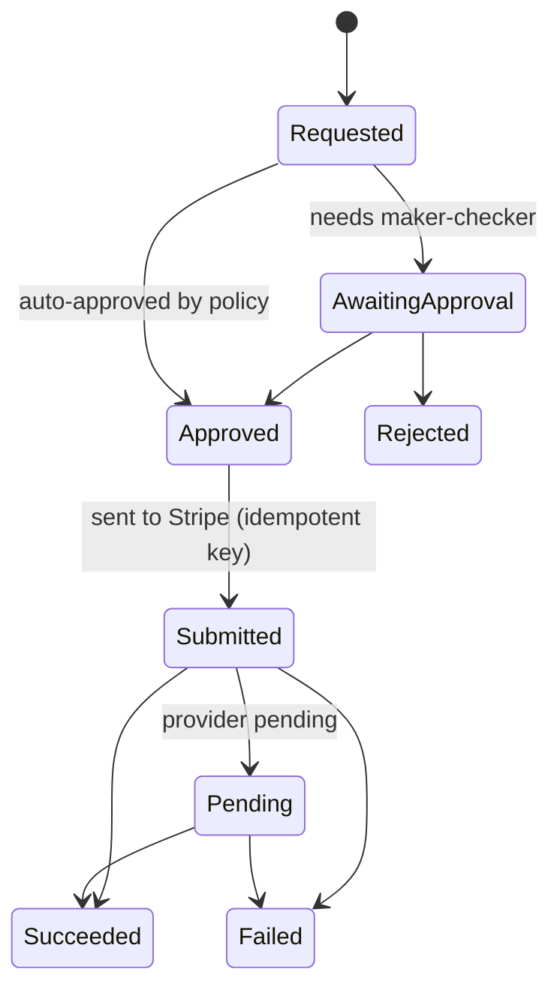

# Payment lifecycle

**Status: Draft.** Proposed in ADR 0006. Q1 is answered for flights (we are merchant of record), so this design applies to flights. Hotels (Q1), provider acceptance, Q2 and Q5 are still open.

**As built (Phase 3 chunk 2), provider-neutral and not Stripe** (decision of 2026-09-26: ADR 0006 is not accepted; Q2 and Q5 are open):
- **The port:** `IPaymentProvider` (Payments module, ADR 0004) returns the shared `ProviderErrorKind` taxonomy, extended with `IdempotencyConflict` (definitive) and `OperationInProgress` (unknown). It has five operations:
  - authorize (manual capture);
  - capture (**once per payment**, at most the authorized amount; a partially confirmed order captures the confirmed total once all its items are final);
  - void (before capture; voiding an unanswered challenge cancels it);
  - refund (each refund is a record with our key, a provider reference and a status of Pending, Succeeded or Failed; the total never exceeds the captured amount);
  - lookups of a payment by our `PaymentReference`, and of a refund by our key.
- **Payment states:** RequiresAction, Authorized, **Declined** (a decline is a state, not an error), **Canceled** (F-21), **Expired** (F-24), Captured and Voided.
- **Keys and references:**
  - A `PaymentReference` is **one payment attempt** (the Payment record's id): an order may need several, e.g. another card after a decline.
  - The keys are `{paymentReference}` for authorize, `{paymentReference}:capture`, `{paymentReference}:void` and `{refundId}:refund`.
  - Providers keep idempotency keys only for a limited window. A repeat long after an `Unknown` is preceded by a lookup, and a `Rejected` answer to a retry of an `Unknown` write means "look it up" before acting.
- **`PaymentOperations` outcomes:** Authorized, ActionRequired, Declined, Canceled, AuthorizationExpired, Captured, Voided, RefundSucceeded, RefundPending, RefundFailed, Rejected, **Unknown**, NotFound (as of an instant) and Mismatch.
- **The payment-method token** is opaque, and a card-number-shaped group of digits that passes the Luhn check is refused. Adapters also check their provider's own token format.
- **Known assumption:** the port models authorization confirmed on the server with a tokenized method, then a customer action and a lookup. Client-side confirmation flows are for ADR 0006 to settle.
- **Not yet built:** the persisted Payment record, webhooks and orchestration come later. The real provider waits for ADR 0006.

## Principles
- Card data never touches our servers: Stripe Elements collects it; we hold PaymentIntent IDs only.
- Amounts come from the server-side order price snapshot.
- **Manual capture**: authorize at checkout, capture after the supplier confirms, void if booking fails.
- Every Stripe write sends an idempotency key derived from our IDs (`{paymentId}:authorize`, `{paymentId}:capture`, `{paymentId}:void`, `{refundId}:refund`; one capture per payment).
- Webhooks are an input, not the only source of truth. The API/Worker can also retrieve the PaymentIntent state directly for reconciliation.

## Payment state machine

## Refund lifecycle (separate record per refund)

Invariants:
- Sum of (Submitted + Pending + Succeeded) refunds ≤ captured amount. This is enforced in the same transaction that creates the refund, under optimistic concurrency.
- A refund request with a reused idempotency key returns the existing refund.
- The customer refund is independent of the supplier refunding us. Both are tracked for reconciliation.

## Webhook handling
1. `Api` receives the webhook, **verifies the signature**, and inserts it into `payments.InboxEvents` (unique `ProviderEventId`). Duplicates are ignored. It returns 2xx quickly.
2. `Worker` processes inbox events in order of receipt. Each handler loads the payment, checks that the transition is valid from the current state (out-of-order tolerance), applies it, and writes the timeline.
3. Unknown event types are stored and ignored (logged at info).

## Reconciliation (finance)
Daily job: our payment and refund records ↔ Stripe balance transactions ↔ payouts. Mismatches go to a finance queue. Supplier statement reconciliation is added with the first real supplier.

Related: [booking lifecycle](booking-lifecycle.md), [security](security.md), [failure scenarios](../quality/failure-scenarios.md).
