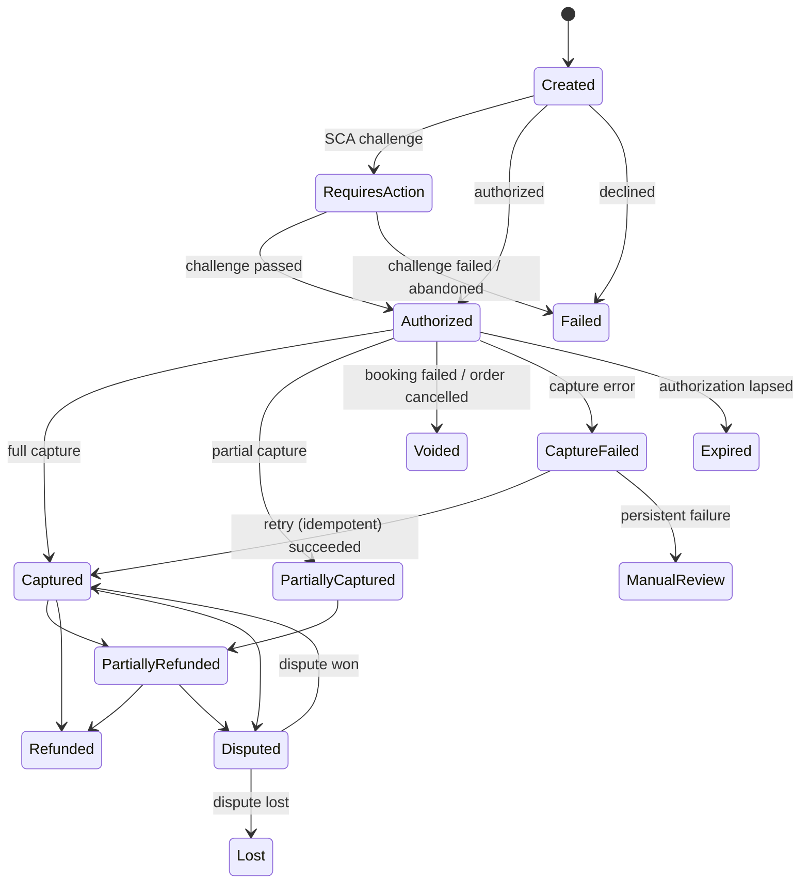
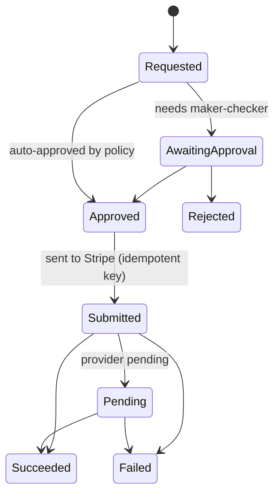

# Payment lifecycle

**Status: Draft.** Proposed in ADR 0006. **The merchant-of-record decision (open question Q1) may change this design.**

## Principles
- Card data never touches our servers: Stripe Elements collects it; we hold PaymentIntent IDs only.
- Amounts come from the server-side order price snapshot.
- **Manual capture**: authorize at checkout, capture after the supplier confirms, void if booking fails.
- Every Stripe write sends an idempotency key derived from our IDs (`{paymentId}:authorize`, `{orderItemId}:capture`, `{refundId}:refund`).
- Webhooks are an input, not the only source of truth. The API/Worker can also retrieve the PaymentIntent state directly for reconciliation.

## Payment state machine

## Refund lifecycle (separate record per refund)

Invariants:
- Sum of (Submitted + Pending + Succeeded) refunds ≤ captured amount. This is enforced in the same transaction that creates the refund, under optimistic concurrency.
- A refund request with a reused idempotency key returns the existing refund.
- The customer refund is independent of the supplier refunding us. Both are tracked for reconciliation.

## Webhook handling
1. `Api` receives the webhook, **verifies the signature**, and inserts it into `payments.InboxEvents` (unique `ProviderEventId`). Duplicates are ignored. It returns 2xx quickly.
2. `Worker` processes inbox events in order of receipt. Each handler loads the payment, checks that the transition is valid from the current state (out-of-order tolerance), applies it, and writes the timeline.
3. Unknown event types are stored and ignored (logged at info).

## Reconciliation (finance)
Daily job: our payment and refund records ↔ Stripe balance transactions ↔ payouts. Mismatches go to a finance queue. Supplier statement reconciliation is added with the first real supplier.

Related: [booking lifecycle](booking-lifecycle.md), [security](security.md), [failure scenarios](../quality/failure-scenarios.md).
