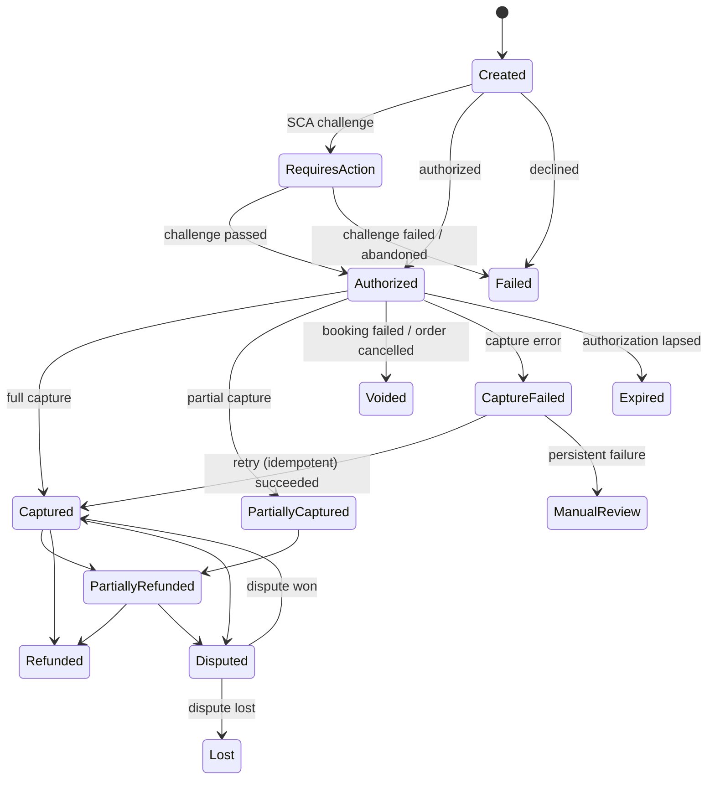
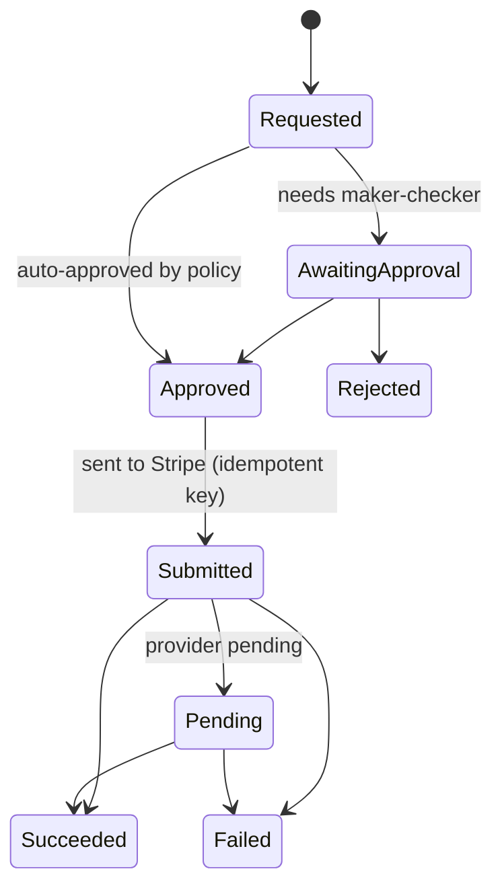

# Payment lifecycle

**Status: Draft.** Proposed in ADR 0006. Q1 is answered for flights (we are merchant of record), so this design applies to flights. Hotels (Q1), provider acceptance, Q2 and Q5 are still open.

**As built (Phase 3 chunk 2), provider-neutral and not Stripe** (decision of 2026-09-26: ADR 0006 is not accepted; Q2 and Q5 are open):
- **The port:** `IPaymentProvider` (Payments module, ADR 0004) returns the shared `ProviderErrorKind` taxonomy, extended with `IdempotencyConflict` (definitive) and `OperationInProgress` (unknown). It has five operations:
  - authorize (manual capture);
  - capture (**once per payment**, at most the authorized amount; a partially confirmed order captures the confirmed total once all its items are final);
  - void (before capture; voiding an unanswered challenge cancels it);
  - refund (each refund is a record with our key, a provider reference and a status of Pending, Succeeded or Failed; the total never exceeds the captured amount);
  - lookups of a payment by our `PaymentReference`, and of a refund by our key.
- **Payment states:** RequiresAction, Authorized, **Declined** (a decline is a state, not an error), **Canceled** (F-21), **Expired** (F-24), Captured and Voided.
- **Keys and references:**
  - A `PaymentReference` is **one payment attempt** (the Payment record's id): an order may need several, e.g. another card after a decline.
  - The keys are `{paymentReference}` for authorize, `{paymentReference}:capture`, `{paymentReference}:void` and `{refundId}:refund`.
  - Providers keep idempotency keys only for a limited window. A repeat long after an `Unknown` is preceded by a lookup, and a `Rejected` answer to a retry of an `Unknown` write means "look it up" before acting.
- **`PaymentOperations` outcomes:** Authorized, ActionRequired, Declined, Canceled, AuthorizationExpired, Captured, Voided, RefundSucceeded, RefundPending, RefundFailed, Rejected, **Unknown**, NotFound (as of an instant) and Mismatch.
- **The payment-method token** is opaque, and a card-number-shaped group of digits that passes the Luhn check is refused. Adapters also check their provider's own token format.
- **Known assumption:** the port models authorization confirmed on the server with a tokenized method, then a customer action and a lookup. Client-side confirmation flows are for ADR 0006 to settle.
- **The payment attempt (Phase 3 chunk 3):** `PaymentAttempt` in schema `payments` is one authorization attempt for an order. Other modules reach it only through `Payments.Contracts` (`IOrderPayments`).
  - It is saved as `Authorizing` **before** the provider call, so a crash never loses a possible hold. Its id is the `PaymentReference`.
  - Its states are Authorizing, ActionRequired, AuthorizationUnknown, Authorized, Declined, Canceled, Expired, Failed and ManualReview. Only the first three are open. Each change is appended to its history (`PaymentAttemptEvents`) with the actor and the request's correlation id; an illegal change (to a final attempt, or back to Authorizing) returns an error.
  - The keys are unique per `(OrderId, IdempotencyKey)`. A filtered unique index allows **one live attempt per order** (one that holds or may hold funds: Authorizing, ActionRequired, AuthorizationUnknown, Authorized, ManualReview), so two tabs cannot hold twice (F-32).
  - The same key returns the stored attempt. An open attempt is **looked up by our reference, never authorized again**. A lookup's "not found" is conclusive only after `Payments:Reconciliation:NotFoundConclusiveAfter` (default 15 minutes; each real provider's ADR states its own). A lookup that reports another amount, or a captured or voided payment, goes to ManualReview.
  - `IOrderPayments.ResumeAsync(order, customer, key)` brings the attempt made with a key up to date, so a caller can finish it before anything else about the order changes.
  - The payment-method token is never stored, so the same key with another token returns the original attempt (no second effect) rather than a 409. Request and result records never print the token or the customer action.
  - Payments trusts the caller's customer id; an architecture test allows only Orders (which checks ownership) to call `IOrderPayments`.
- **Background reconciliation and hold release (Phase 3, row 4):** the Worker's `payments.reconcile-attempts` job looks up open attempts (Authorizing, AuthorizationUnknown, ActionRequired) once they have been unchanged for `Payments:Reconciliation:LookupAfter` (1 minute by default). When Orders will not use a payment, it publishes `OrderPaymentReleaseRequested` (Orders outbox). Payments records it once (inbox) as `ReleaseRequestedAt`, and the job then releases the hold once its outcome is known:
  - Authorized → `Voiding` (saved first) → `Voided`;
  - an unfinished challenge → `Canceled`;
  - a timed-out void → `VoidUnknown`, looked up, then voided again with the same key (`{attempt}:void`) only while still held;
  - a refused void, or an unexpected lookup → `ManualReview`.
  - Voiding and VoidUnknown count as live, so no new attempt starts while a hold may exist. Nothing is captured.
  - The mock keeps payments in memory per process, so a separately started Worker cannot see the Api's mock payments.
- **Built since (ADR 0006, Proposed):** provider notifications (webhooks, below) and a Stripe adapter mapped from documentation. It is not production-ready and is refused outside Development and Staging.
- **Not yet built, and gates for exposing checkout:**
  - capture on the attempt;
  - an audited operator way out of ManualReview;
  - a cap on attempts per order and customer, with generic declines to clients (card testing; a fraud-policy question, Q10);
  - any customer payment endpoint.

  The not-found consistency window (`Payments:Reconciliation:NotFoundConclusiveAfter`) must be at least the provider's declared minimum, which startup enforces: 1 hour for Stripe's search. If it is too short, a later attempt could hold funds twice.

## Principles
- Card data never touches our servers: Stripe Elements collects it; we hold PaymentIntent IDs only.
- Amounts come from the server-side order price snapshot.
- **Manual capture**: authorize at checkout, capture after the supplier confirms, void if booking fails.
- Every Stripe write sends an idempotency key derived from our IDs (`{paymentId}:authorize`, `{paymentId}:capture`, `{paymentId}:void`, `{refundId}:refund`; one capture per payment).
- Webhooks are an input, not the only source of truth. The API/Worker can also retrieve the PaymentIntent state directly for reconciliation.

## Payment state machine

```mermaid
stateDiagram-v2
  [*] --> Created
  Created --> RequiresAction: SCA challenge
  RequiresAction --> Authorized: challenge passed
  RequiresAction --> Failed: challenge failed / abandoned
  Created --> Authorized: authorized
  Created --> Failed: declined
  Authorized --> Captured: full capture
  Authorized --> PartiallyCaptured: partial capture
  Authorized --> Voided: booking failed / order cancelled
  Authorized --> CaptureFailed: capture error
  CaptureFailed --> Captured: retry (idempotent) succeeded
  CaptureFailed --> ManualReview: persistent failure
  Authorized --> Expired: authorization lapsed
  Captured --> PartiallyRefunded
  PartiallyCaptured --> PartiallyRefunded
  PartiallyRefunded --> Refunded
  Captured --> Refunded
  Captured --> Disputed
  PartiallyRefunded --> Disputed
  Disputed --> Captured: dispute won
  Disputed --> Lost: dispute lost
```

## Refund lifecycle (separate record per refund)

```mermaid
stateDiagram-v2
  [*] --> Requested
  Requested --> AwaitingApproval: needs maker-checker
  AwaitingApproval --> Approved
  AwaitingApproval --> Rejected
  Requested --> Approved: auto-approved by policy
  Approved --> Submitted: sent to Stripe (idempotent key)
  Submitted --> Succeeded
  Submitted --> Failed
  Submitted --> Pending: provider pending
  Pending --> Succeeded
  Pending --> Failed
```

Invariants:
- Sum of (Submitted + Pending + Succeeded) refunds ≤ captured amount. This is enforced in the same transaction that creates the refund, under optimistic concurrency.
- A refund request with a reused idempotency key returns the existing refund.
- The customer refund is independent of the supplier refunding us. Both are tracked for reconciliation.

## Confirmation flow (ADR 0006, option A)
1. The browser's hosted fields (Stripe Payment Element) create a token. Card data goes only to the provider (SAQ-A).
2. The checkout step sends the token, never an amount. The server saves the attempt as Authorizing, then creates and confirms the payment in one call. The amount is the order's server-side total, the call uses manual capture, and it is keyed by our payment reference.
3. The outcome:
   - **Authorized** means the booking may start;
   - **ActionRequired** returns the challenge secret to the order's owner only, and the browser runs the challenge (e.g. 3DS);
   - **Declined** is final, and another card is a new attempt.
4. The challenge's result is never taken from the browser. It is learnt from a lookup: when the customer repeats the step with the same key, when reconciliation runs, or when a notification prompts one. With the provider's payment id known, the lookup reads the payment directly, which is consistent at once.
5. An abandoned challenge stays ActionRequired (never paid). When the order's offer expires, the release request cancels it (payment-hold-release runbook).

## Webhook handling (notifications)
1. The `Api` receives `POST /api/v1/payments/notifications/{providerId}`. The route is anonymous (the provider's signature authenticates it) and mapped only when the composed provider sends notifications. The adapter **verifies the signature over the raw body**, including its age (replay tolerance). A rejection is a 400 and a security event, and nothing is stored.
2. A verified notification is stored as one row in `payments.PaymentNotifications`, unique on (provider, event id), so a duplicate is acknowledged and changes nothing. Only the event id, the kind, our reference and the provider's payment id are kept, not the raw event (personal data, Q9). This deviates from the booking rules and is still to be confirmed (ADR 0006, decision 4). Event types the core does not use are acknowledged and not stored. The endpoint answers 200 quickly.
3. The `Worker` job processes notifications in order of receipt: it reconciles the attempt they concern, which means a **lookup** with the provider. It never applies the event's content (the provider payment id it carries is only a hint for a direct read). So late and out-of-order events are harmless: an open attempt is looked up and gets the current state. A settled attempt is looked up too, and a hold found on one we consider over is voided at once with its own key, recorded, and alerted. The attempt stays final. An Authorized hold that lapses (F-24) is detected with capture orchestration. The row records what processing did, and processing markers (processed at, attempts, outcome) are updated on it, like the outbox's. Refund notifications are recorded but not acted on until refunds are persisted.

## Reconciliation (finance)
Daily job: our payment and refund records ↔ Stripe balance transactions ↔ payouts. Mismatches go to a finance queue. Supplier statement reconciliation is added with the first real supplier.

Related: [booking lifecycle](booking-lifecycle.md), [security](security.md), [failure scenarios](../quality/failure-scenarios.md).
